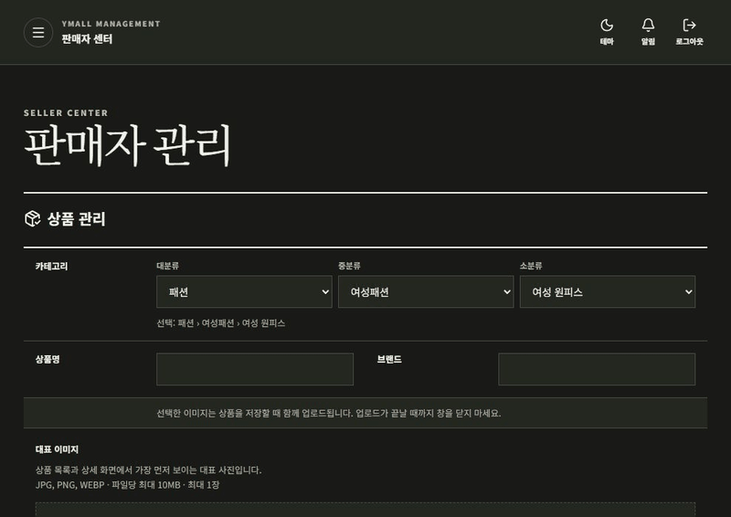
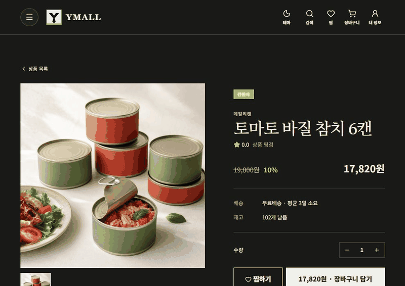
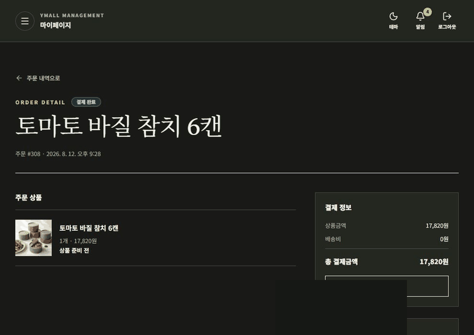
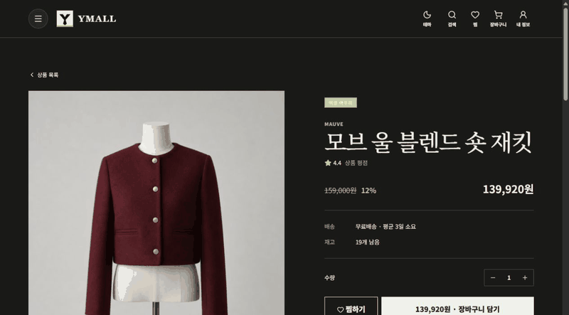
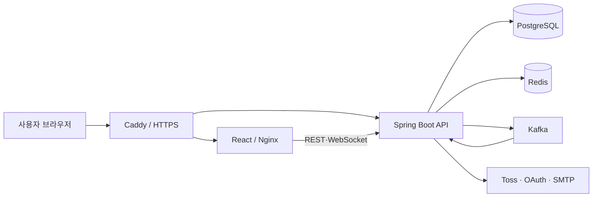

# YMall

> 주문과 결제부터 이벤트 신뢰성, AI 활용, 보안 점검, 실제 배포까지 서비스 운영 과정의 문제를 직접 정의하고 해결한 커머스 프로젝트입니다.

[](https://github.com/yspaceS2/YMall/actions/workflows/ci.yml)
[](https://github.com/yspaceS2/YMall/actions/workflows/security.yml)
[](https://github.com/yspaceS2/YMall/actions/workflows/zap.yml)

이름으로 많이 접했던 Redis, Kafka, CI/CD 같은 기술을 단순 예제로 공부하는 대신, 실제 서비스의 업무 흐름 안에서 사용해보고 싶어 시작했습니다. 판매자가 상품을 등록하고 관리자가 승인한 뒤, 회원이 주문·결제·환불하고 결과가 알림과 정산으로 이어지는 과정을 하나의 서비스로 구현했습니다.

처음부터 모든 기술을 알고 시작한 것은 아닙니다. 기능을 만들고 새로운 요구사항이 생길 때마다 필요한 기술을 학습하고, 이미 만든 구조를 다시 활용하거나 고치는 방식으로 프로젝트를 확장했습니다. 빠르게 구현하는 데서 끝내지 않고 테스트, 보안 점검, 운영 배포와 복원까지 직접 확인하는 것을 목표로 했습니다.

- 운영 주소: [https://ymall.cloud](https://ymall.cloud)
- 배포 환경: Oracle Cloud Infrastructure (Japan East · Tokyo)
- 개발 형태: 개인 풀스택 프로젝트 · 백엔드 중심

> 운영 서버는 비용 관리를 위해 중지될 수 있습니다. 이 경우 아래 GIF와 문서에서 주요 기능을 확인할 수 있습니다.

## 주요 기능 시연

### 1. 상품 등록과 관리자 승인

판매자가 이미지와 3단계 카테고리를 선택해 상품을 등록하면 관리자 검수 목록에 표시됩니다. 관리자가 승인한 상품만 판매 상태로 전환되어 회원에게 노출됩니다.



### 2. 주문과 Toss Payments 결제

회원이 배송지를 선택하고 주문한 뒤 Toss Payments 테스트 결제를 진행합니다. 프론트의 결제 성공 화면만 신뢰하지 않고, 백엔드에서 주문자·주문 금액·결제 상태와 승인 결과를 다시 확인한 후 결제를 완료합니다.



### 3. 결제 환불

주문 상세 화면에서 환불을 신청하면 결제 상태와 환불 가능 금액을 검증한 뒤 Toss Payments 취소 API를 호출합니다. 중복 요청과 원결제 금액을 초과하는 환불을 방지하도록 처리했습니다.



### 4. 상품별 리뷰 AI 요약

리뷰가 일정 수 이상 쌓이면 상품별 장점, 아쉬운 점과 구매 참고 내용을 요약합니다. 모든 상품에 같은 문장이 표시되지 않도록 상품과 리뷰의 특성이 요약 결과에 반영되는 데모 데이터를 구성했습니다.



### 5. 홈 상품 큐레이션

판매량, 최근 판매 시각과 승인 시각을 기준으로 홈 화면의 상품을 구성합니다. 데모 데이터도 화면에 상품을 임의로 고정하지 않고 기존 큐레이션 기준을 유지하도록 만들었습니다.


## 사용자별 기능

| 사용자 | 주요 기능 |
| --- | --- |
| 회원 | 일반·소셜 로그인, 상품 검색, 장바구니, 주문·결제, 환불, 리뷰, 문의, 알림 |
| 판매자 | 상품·재고 관리, 주문·반품 대응, 정산 요청, 대시보드 |
| 관리자 | 회원·판매자·상품 승인, 주문·정산·문의 관리, RBAC 권한 관리 |

상품은 대분류-중분류-소분류의 3단계 카테고리로 관리하며, 검색·필터·정렬과 홈 화면 추천 영역을 제공합니다.

## 시스템 구성



운영 환경은 OCI 인스턴스 한 대에서 Docker Compose로 구성했습니다. 외부에는 HTTPS 진입점만 공개하고 PostgreSQL, Redis, Kafka는 내부 Docker 네트워크에서 통신합니다. 상세한 책임과 데이터 흐름은 [아키텍처 문서](docs/architecture.md)에 정리했습니다.

## 기술 스택

| 영역 | 기술 |
| --- | --- |
| Frontend | React 19, TypeScript, Vite, Tailwind CSS, TanStack Query, Vitest, Playwright |
| Backend | Java 17, Spring Boot, Spring Security, JPA, Flyway, MapStruct |
| Data·Messaging | PostgreSQL, Redis, Kafka, Transactional Outbox |
| AI | Qwen3 4B Q4, Python inference service |
| Infra | OCI, Docker Compose, Caddy, Nginx, GitHub Actions |
| 관측·검증 | Prometheus, Grafana, k6, Testcontainers, OWASP ZAP, Trivy, Semgrep, Gitleaks |

## 기술적으로 고민한 부분

### DB 저장과 이벤트 발행 사이의 유실

주문 데이터 저장에는 성공했지만 Kafka 발행에 실패하면 후속 알림이나 통계 처리가 누락될 수 있었습니다. 주문과 Outbox 이벤트를 같은 DB 트랜잭션으로 저장하고, 별도의 Relay가 발행하도록 변경했습니다. 발행 실패는 재시도하며 반복 실패한 메시지는 DLT로 분리해 확인할 수 있도록 했습니다.

### 결제 성공 화면만으로는 결제를 완료할 수 없는 문제

브라우저의 성공 콜백 값은 변조되거나 중복 호출될 수 있습니다. 백엔드가 상품 가격으로 결제 금액을 다시 계산하고 주문자, 주문 상태, Toss 승인 결과를 확인하도록 구성했습니다. 승인·취소·환불·웹훅에는 멱등성 검사를 적용했습니다.

### 역할 확인만으로 막을 수 없는 접근

같은 회원 역할이라도 다른 사람의 주문과 리뷰에 접근해서는 안 되고, 판매자도 자신의 상품만 수정할 수 있어야 합니다. 화면에서 버튼을 숨기는 것과 별개로 서비스 계층에서 현재 사용자와 리소스 소유자를 비교하도록 정리했습니다.

### 제한된 OCI 자원에서 AI 모델 운영

리뷰 요약 기능을 로컬에서 구현하는 것과 2 OCPU·12GB 운영 인스턴스에서 계속 실행하는 것은 다른 문제였습니다. 요청과 동시에 모델을 호출하면 CPU 추론이 끝날 때까지 사용자가 기다려야 하고, 여러 요청이 겹치면 다른 API에도 영향을 줄 수 있었습니다.

리뷰가 변경되면 Kafka 이벤트를 발행하고 AI 서비스가 이를 비동기로 처리하도록 구성했습니다. 요약을 생성하는 동안에는 기존 요약을 계속 제공하며, 운영 환경에서는 동시 추론을 1건으로 제한했습니다. 모델을 끄는 대신 제한된 자원 안에서 서비스 응답성과 기능을 함께 유지하는 방향을 선택했고, 실제 운영 도메인에서 리뷰 등록부터 요약 갱신까지 확인했습니다.

### 로컬 데이터를 운영 환경으로 이전하며 알게 된 DB와 파일의 차이

로컬에서 만든 카테고리, 상품, 주문과 리뷰 데이터를 PostgreSQL 백업으로 복원했지만 상품 이미지가 나타나지 않았습니다. DB에는 이미지 자체가 아니라 파일 경로만 저장되고, 실제 파일은 별도의 Docker 업로드 볼륨에 있었기 때문입니다.

이후 PostgreSQL custom format 백업과 업로드 볼륨 압축 파일을 같은 시각의 하나의 백업 세트로 관리하도록 정리했습니다. 백업 파일에는 SHA-256 체크섬을 만들고, 검증할 때는 운영 DB를 덮어쓰지 않고 임시 DB에 복원합니다. 실제 복구에서는 DB와 업로드 볼륨을 함께 복원해야 경로와 파일이 일치하도록 절차를 문서화했습니다.

이 과정을 통해 데이터베이스 백업만으로 서비스가 복구된다고 볼 수 없으며, 애플리케이션이 관리하는 파일까지 복구 범위에 포함해야 한다는 점을 배웠습니다.

## 품질과 보안

- Backend JaCoCo 라인 커버리지 85.69%
- Frontend Vitest 194개 테스트와 커버리지 측정(Statements 48.14%, Branches 43.05%, Functions 44.50%, Lines 49.91%)
- Backend 단위·통합 테스트와 Testcontainers 기반 PostgreSQL 검증
- Frontend Vitest 단위 테스트와 Playwright E2E 테스트
- PR마다 Backend, Frontend, E2E, API 계약, Secret Scan 수행
- 의존성·컨테이너·동적 웹 보안 검사와 KISA 기준 자체 점검
- 운영 비밀값은 저장소에 포함하지 않고 환경변수나 배포 Secret으로 주입
- 운영 환경에서 Google·Naver·Kakao OAuth와 Gmail SMTP 인증 메일 검증
- Toss Payments 테스트 결제와 전체 환불 흐름 검증
- PostgreSQL과 업로드 파일의 정기 백업 및 복원 절차 문서화
- `main` 배포는 GitHub Actions에서 수동 승인 후 실행하고 결과를 Slack으로 알림

자동 배포를 무조건 실행하기보다 개인 운영 서버의 비용과 장애 가능성을 고려해 배포 시점을 직접 선택할 수 있도록 구성했습니다.

프론트엔드 커버리지는 측정 체계를 갖추고 핵심 흐름을 보호하기 시작한 단계입니다. 앞으로는 숫자 자체를 높이기보다 결제, 인증, 권한별 화면과 실패 처리처럼 변경 위험이 큰 영역부터 보강할 계획입니다.

## 프로젝트 관리와 AI 활용

초기 MVP 범위와 설계는 Notion에 정리하고, 실제 구현 작업과 완료 조건은 Jira에서 관리했습니다. 구현 중 발견한 문제나 추가 요구사항도 바로 코드부터 바꾸기보다 Jira 작업으로 다시 정의했습니다. 개발 환경, 용어, 의사결정, 기술 조사와 회고는 Notion의 공통 문서로 남겨 코드가 여러 차례 바뀐 뒤에도 현재 구현과 맞도록 다시 검토했습니다.

프로젝트 규칙은 [AGENTS.md](AGENTS.md)에 명문화했습니다. 브랜치 전략, 코드 규칙, 비밀정보 처리, 보안 검토와 검증 기준을 AI 도구에도 동일하게 적용하기 위한 문서입니다.

AI는 낯선 기술의 진입 장벽을 낮추고 구현 속도를 높이는 데 적극적으로 사용했습니다. 대신 요구사항과 완료 기준을 먼저 정하고, 생성된 결과는 화면, 코드, 테스트와 CI를 통해 직접 확인했습니다. 빠른 구현 과정에서 쌓인 기술부채는 프로젝트 후반의 코드 리뷰와 리팩터링 작업으로 다시 찾아 보완했습니다. 이 경험을 통해 AI가 속도를 높여주더라도 설계 판단과 검증, 보안과 유지보수의 책임은 결국 개발자에게 있다는 점을 배웠습니다.

## 문서 안내

| 구분 | 문서 |
| --- | --- |
| 프로젝트 이해 | [아키텍처](docs/architecture.md) · [데이터 모델](docs/database.md) · [API 개요](docs/api-overview.md) · [기술적 회고](docs/retrospective.md) |
| 실행과 운영 | [Docker Compose](docs/docker-compose.md) · [OCI 배포](docs/deployment/oci.md) · [문제 해결](docs/troubleshooting.md) · [모니터링](monitoring/README.md) · [부하 테스트](load-test/README.md) |
| 이벤트·결제 | [Transactional Outbox](docs/transactional-outbox.md) · [Kafka 재시도·DLT](docs/kafka-retry-dlt.md) · [결제](docs/toss-payments.md) · [웹훅](docs/payment-webhooks.md) |
| 보안·검증 | [PostgreSQL 통합 테스트](docs/postgresql-integration-tests.md) · [보안 자동화](docs/security/security-automation.md) · [KISA 자체 점검](docs/security/kisa-2026-assessment.md) |

## 로컬 실행

### 전체 환경을 Docker로 실행

필수 도구는 Git과 Docker Desktop입니다. 프로젝트 루트에서 다음 명령을 실행합니다.

```powershell
Copy-Item .env.example .env
docker compose up -d --build
docker compose ps
```

서비스가 정상 상태가 되면 [http://localhost:5173](http://localhost:5173)에 접속합니다. OAuth, 이메일, 테스트 결제를 사용하려면 `.env`에 개인 환경값을 설정하되 비밀값은 커밋하지 않습니다.

```powershell
docker compose logs -f backend frontend
docker compose down
```

데이터를 유지하려면 일반 종료 시 `--volumes`를 붙이지 않습니다.

### 애플리케이션만 직접 실행

PostgreSQL, Redis, Kafka 등 기반 서비스는 Docker로 실행하고 Backend와 Frontend만 개발 도구에서 실행할 수도 있습니다.

```powershell
# 기반 서비스
docker compose up -d postgres redis kafka

# Backend
cd backend
.\gradlew.bat bootRun --args='--spring.profiles.active=local'

# Frontend (별도 터미널)
cd frontend
npm install
npm run dev
```

IntelliJ 터미널에서 모두 실행해도 되고, Backend는 IntelliJ, Frontend는 VS Code에서 각각 실행해도 결과는 같습니다. IDE별 설정과 장애 대응은 [통합 실행 가이드](docs/docker-compose.md)와 [문제 해결 문서](docs/troubleshooting.md)를 참고해 주세요.

## 데모 계정과 결제 안내

공개 저장소에는 계정 비밀번호를 기록하지 않습니다. 포트폴리오 검토가 필요한 경우 회원, 판매자, 매니저 역할의 데모 계정 접속 정보를 별도로 제공합니다. 관리자와 슈퍼바이저 계정은 데이터 변경 범위가 넓어 공개하지 않습니다.

결제 기능은 Toss Payments 테스트 환경만 사용하며 실제 결제는 발생하지 않습니다.

## 배포 상태

OCI Japan East(Tokyo)의 ARM64 인스턴스와 `ymall.cloud`를 기준으로 운영 Compose, HTTPS 리버스
프록시, 수동 승인형 CD와 Slack 배포 알림을 구성했습니다. 운영 배포는 검증된 `main`을 대상으로 운영자가
시작하고, 이후 갱신·헬스체크·실패 시 롤백·결과 알림은 자동으로 수행합니다. 운영 OAuth와 SMTP,
Toss Payments 테스트 결제 승인과 전체 환불을 실제 도메인에서 검증했고,
PostgreSQL 및 업로드 파일은 매일 자정(KST)에 백업하여 7일간 보관하고 비공개 OCI Object Storage 버킷으로 복제합니다. 구체적인 배포, 백업과
복원 검증 절차는 [OCI 배포 가이드](docs/deployment/oci.md)에 정리했습니다.

## 회고

새로운 기술을 완전히 이해한 뒤 시작하려 하기보다 실제 문제에 적용하고 실패를 관찰하면서 배우는 과정이 중요하다는 것을 알게 됐습니다. Redis와 Kafka도 처음에는 이름과 용도만 알고 있었지만, 직접 기능에 적용한 뒤에는 새로운 요구사항이 생겼을 때 기존 구조를 어떻게 응용할지 고민할 수 있게 됐습니다.

동시에 빠른 구현만으로 프로젝트가 완성되는 것은 아니었습니다. 기능이 많아질수록 기술부채가 생겼고, 테스트와 보안, 문서와 실제 코드의 차이를 다시 확인하는 시간이 필요했습니다. 앞으로도 AI를 적극적으로 활용하되 결과를 설명하고 검증할 수 있는 개발자가 되는 것을 목표로 하고 있습니다.

---

© 2026 YMall. Portfolio project.
