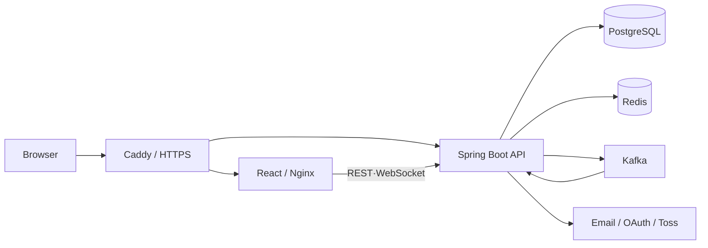

# YMall

YMall은 회원·판매자·관리자의 상품 탐색, 주문·결제, 판매 운영과 관리자 업무를 하나의 서비스로 구현한 풀스택 커머스 포트폴리오입니다.

> 현재 상태: 로컬 통합 실행과 자동 검증, OCI 운영 배포, 운영 OAuth·SMTP 및 Toss 테스트 결제·환불 검증을 완료했습니다.

## 프로젝트 한눈에 보기

| 사용자 | 주요 기능 |
| --- | --- |
| 회원 | 회원가입·OAuth 로그인, 상품 검색, 장바구니, 주문·결제, 리뷰, 문의, 알림 |
| 판매자 | 상품·재고 관리, 주문·반품 대응, 정산 요청, 대시보드 |
| 관리자 | 회원·판매자·상품 승인, 주문·정산·문의 관리, RBAC 권한 관리 |

- 3단계 카테고리와 검색·필터·정렬을 지원하는 상품 탐색
- 서버 금액 검증, 멱등성, 웹훅 중복 방지를 적용한 Toss Payments 결제
- Transactional Outbox와 Kafka 재시도·DLT를 이용한 주문 이벤트 전달
- Redis 기반 Refresh Token 관리와 상품·홈 화면 캐시
- 출처 추적과 개인정보 제거를 적용한 상품 리뷰 AI 요약

## 시스템 구성



기본 Docker Compose 구성에서는 Frontend만 `5173` 포트에 공개하고 나머지 서비스는 내부 네트워크에서 통신합니다. 상세한 책임과 데이터 흐름은 [아키텍처 문서](docs/architecture.md)에 정리했습니다.

## 기술 스택

| 영역 | 기술 |
| --- | --- |
| Frontend | React 19, TypeScript 6, Vite 8, Tailwind CSS 4, Vitest, Playwright |
| Backend | Java 17, Spring Boot 4.1, Spring Security, JPA, Flyway, MapStruct |
| Data·Messaging | PostgreSQL, Redis, Kafka, Transactional Outbox |
| Infra·관측 | OCI, Docker Compose, Caddy, Nginx, GitHub Actions, Prometheus, Grafana, k6 |

## 주요 설계 판단

- **주문 이벤트 일관성**: 주문과 Outbox를 한 트랜잭션으로 저장하여 DB 반영과 메시지 발행 사이의 유실 구간을 줄였습니다.
- **안전한 결제 전이**: 주문 금액을 서버에서 다시 계산하고 승인·취소·환불·웹훅의 멱등성과 상태를 검증합니다.
- **Backend 권한 검증**: 화면 노출 제어와 별개로 역할과 리소스 소유권을 Backend에서 확인합니다.
- **운영 가능한 비동기 처리**: Kafka 재시도·DLT와 Outbox 지표로 일시 장애와 영구 실패를 구분합니다.
- **측정 기반 개선**: k6와 Prometheus·Grafana로 조회·혼합·스파이크 부하와 병목을 재현합니다.

## 품질과 보안

- Backend 단위·통합 테스트와 Testcontainers 기반 PostgreSQL 검증
- Frontend Vitest 단위 테스트와 Playwright E2E 테스트
- PR마다 Backend, Frontend, E2E, API 계약, Secret Scan 수행
- 의존성·컨테이너·동적 웹 보안 검사와 KISA 기준 자체 점검
- 운영 비밀값은 저장소에 포함하지 않고 환경변수나 배포 Secret으로 주입

## 문서 안내

| 구분 | 문서 |
| --- | --- |
| 프로젝트 이해 | [아키텍처](docs/architecture.md) · [데이터 모델](docs/database.md) · [API 개요](docs/api-overview.md) · [기술적 회고](docs/retrospective.md) |
| 실행과 운영 | [Docker Compose](docs/docker-compose.md) · [OCI 배포](docs/deployment/oci.md) · [문제 해결](docs/troubleshooting.md) · [모니터링](monitoring/README.md) · [부하 테스트](load-test/README.md) |
| 이벤트·결제 | [Transactional Outbox](docs/transactional-outbox.md) · [Kafka 재시도·DLT](docs/kafka-retry-dlt.md) · [결제](docs/toss-payments.md) · [웹훅](docs/payment-webhooks.md) |
| 보안·검증 | [PostgreSQL 통합 테스트](docs/postgresql-integration-tests.md) · [보안 자동화](docs/security/security-automation.md) · [KISA 자체 점검](docs/security/kisa-2026-assessment.md) |

## 빠른 실행

필수 도구는 Git과 Docker Desktop입니다. 프로젝트 루트에서 다음 명령을 실행합니다.

```powershell
Copy-Item .env.example .env
docker compose up -d --build
docker compose ps
```

서비스가 정상 상태가 되면 [http://localhost:5173](http://localhost:5173)에 접속합니다. OAuth, 이메일, 실제 결제를 사용하려면 `.env`에 개인 환경값을 설정하되 비밀값은 커밋하지 않습니다.

```powershell
docker compose logs -f backend frontend
docker compose down
```

데이터를 유지하려면 일반 종료 시 `--volumes`를 붙이지 않습니다. IDE별 실행, 초기 데이터와 장애 대응은 [통합 실행 가이드](docs/docker-compose.md)와 [문제 해결 문서](docs/troubleshooting.md)를 참고해 주세요.

## 배포 상태

OCI Japan East(Tokyo)의 ARM64 인스턴스와 `ymall.cloud`를 기준으로 운영 Compose, HTTPS 리버스
프록시, 수동 승인형 CD와 Slack 배포 알림을 구성했습니다. 운영 배포는 검증된 `main`을 대상으로 운영자가
시작하고, 이후 갱신·헬스체크·실패 시 롤백·결과 알림은 자동으로 수행합니다. 운영 OAuth와 SMTP,
Toss Payments 테스트 결제 승인과 전체 환불을 실제 도메인에서 검증했고,
PostgreSQL 및 업로드 파일은 매일 자정(KST)에 백업하여 7일간 보관합니다. 구체적인 배포, 백업과
복원 검증 절차는 [OCI 배포 가이드](docs/deployment/oci.md)에 정리했습니다.
