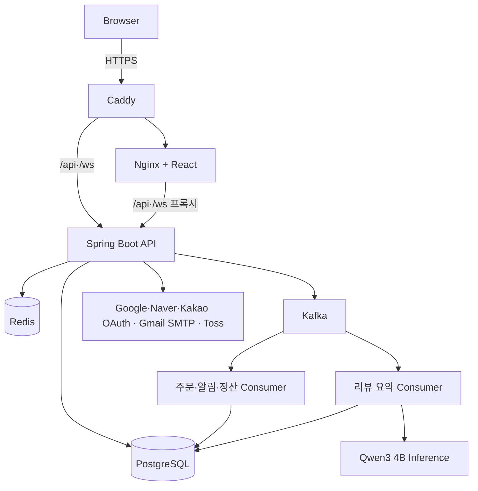
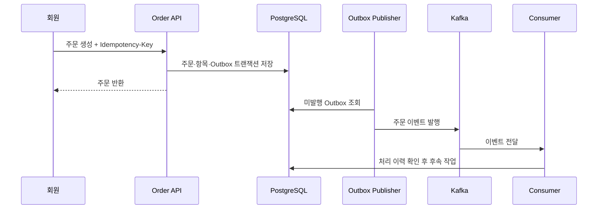
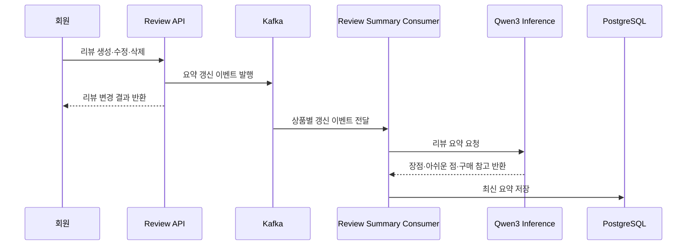

# YMall 아키텍처

## 구조와 목표

YMall은 웹, API, 영속 데이터, 캐시, 메시징과 AI 추론 구성을 한 저장소에서 관리하는 모듈형 모놀리스입니다. 기능 개발과 단일 인스턴스 배포의 단순성을 유지하면서 도메인 경계를 분리하고, 주문 후속 처리와 리뷰 요약처럼 사용자 응답에서 분리할 작업을 Kafka로 연결합니다.

| 구성요소 | 책임 |
| --- | --- |
| React·Nginx | 역할별 UI, 정적 파일 제공, API·WebSocket 프록시 |
| Caddy | 운영 도메인의 HTTPS 종료와 Frontend·Backend 라우팅 |
| Spring Boot | 인증·인가, 비즈니스 정책, 외부 연동, 이벤트 생성·소비 |
| PostgreSQL | 회원, 상품, 주문, 결제, AI 요약과 Outbox 영속화 |
| Redis | Refresh Token 상태, 로그인 제한, 조회 캐시와 AI 중복 실행 잠금 |
| Kafka | 주문 후속 처리와 리뷰 요약 갱신 이벤트 전달 |
| AI inference | Qwen3 4B Q4 모델을 이용한 상품별 리뷰 요약 생성 |

## Backend 도메인

`com.ymall.backend` 아래에 `member`, `seller`, `product`, `home`, `cart`, `order`, `payment`, `review`, `notification`, `settlement`, `support`, `admin`, `file` 등으로 책임을 나눕니다. Controller는 요청·응답, Service는 정책과 트랜잭션, Repository는 영속성에 집중하며 Entity를 API에 직접 노출하지 않습니다.

## 주문 이벤트 흐름

발행 실패는 Outbox 상태로 남겨 재시도하고 Consumer 실패는 재시도 Topic과 DLT로 구분합니다. 처리 이력은 중복 전달의 영향을 제한합니다.

## 리뷰 요약 흐름

AI 요약은 사용자 요청과 분리해 비동기로 생성합니다. 생성 중에는 기존 요약을 제공하고 Redis 잠금으로 같은 상품의 동시 갱신을 제한합니다. 운영 인스턴스에서는 CPU와 메모리 사용을 고려해 추론을 한 건씩 수행합니다.

## 결제와 권한 경계

Frontend 성공 Callback만으로 결제 완료 처리하지 않습니다. Backend가 사용자, 주문 상태, 서버 계산 금액과 Toss 결과를 확인한 뒤 상태를 변경합니다. 웹훅도 중복과 상태 역행을 검증합니다. Access Token 인증 뒤에도 회원의 주문, 판매자의 상품처럼 리소스 소유권을 다시 확인합니다.

## 배포 경계

로컬 환경은 Docker Compose로 전체 구성을 재현하며 Frontend 포트만 호스트에 공개합니다. 운영 환경은 OCI Japan East의 Ampere A1 인스턴스 한 대에서 실행하고 Caddy의 80·443 포트만 외부에 공개합니다. PostgreSQL, Redis, Kafka와 AI 서비스는 내부 Docker 네트워크에서 통신합니다.

운영 비밀값은 GitHub Secrets와 서버 환경 파일로 주입합니다. `main` 배포는 GitHub Actions에서 운영자가 수동으로 시작하며 이미지 갱신, 헬스체크, 실패 시 롤백과 Slack 알림은 자동으로 수행합니다. PostgreSQL과 업로드 볼륨은 같은 백업 세트로 매일 보관하고 임시 DB 복원과 체크섬으로 검증합니다. 완성된 백업은 Instance Principal을 사용해 비공개 OCI Object Storage 버킷으로 복제합니다.

## 관련 문서

- [데이터 모델](database.md)
- [API 개요](api-overview.md)
- [Transactional Outbox](transactional-outbox.md)
- [Kafka 재시도와 DLT](kafka-retry-dlt.md)
- [결제 웹훅](payment-webhooks.md)
- [AI 리뷰 요약 추론](ai/review-summary-inference.md)
- [OCI 배포와 복구](deployment/oci.md)
