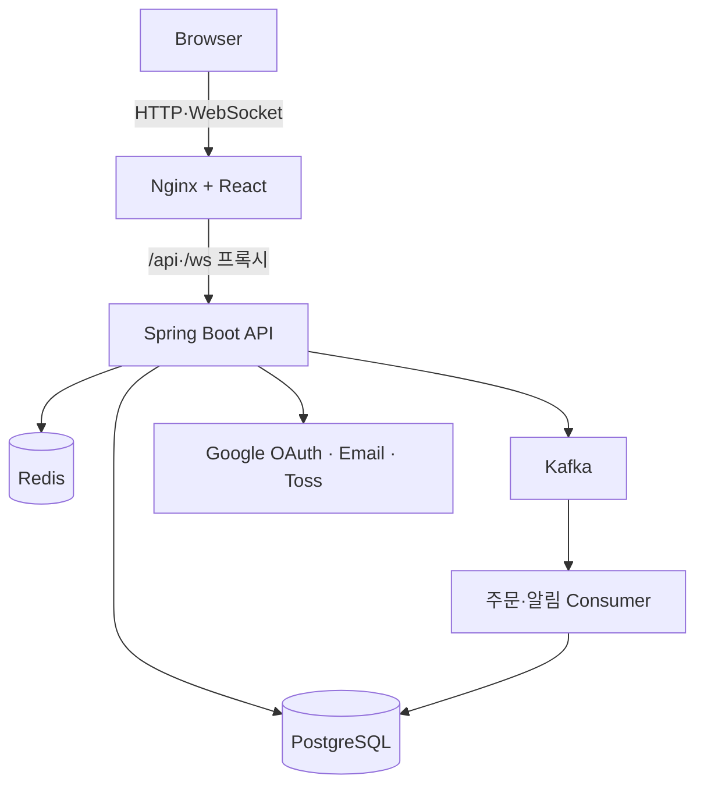
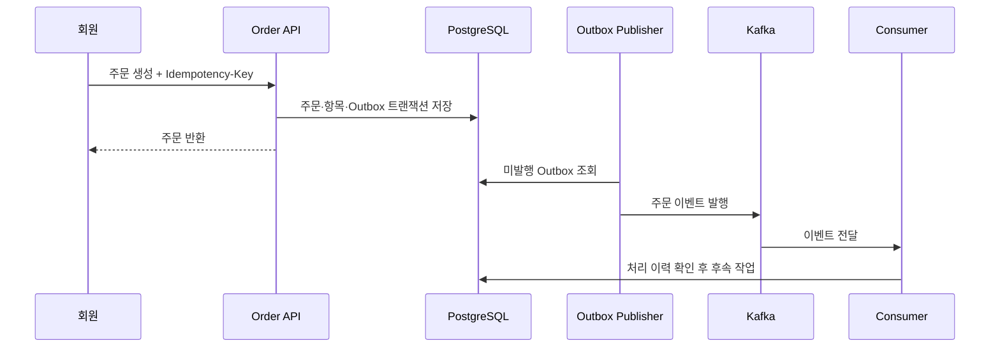

# YMall 아키텍처

## 구조와 목표

YMall은 웹, API, 영속 데이터, 캐시와 메시징을 한 저장소에서 관리하는 모듈형 모놀리스입니다. 기능 개발과 배포의 단순성을 유지하면서 도메인 경계를 분리하고, 비동기 처리가 필요한 주문 후속 작업만 Kafka로 연결합니다.

| 구성요소 | 책임 |
| --- | --- |
| React·Nginx | 역할별 UI, 정적 파일 제공, API·WebSocket 프록시 |
| Spring Boot | 인증·인가, 비즈니스 정책, 외부 연동, 이벤트 생성·소비 |
| PostgreSQL | 회원, 상품, 주문, 결제와 Outbox 영속화 |
| Redis | Refresh Token 상태와 조회 캐시 |
| Kafka | 주문 이벤트와 후속 처리 전달 |

## Backend 도메인

`com.ymall.backend` 아래에 `member`, `seller`, `product`, `cart`, `order`, `payment`, `review`, `notification`, `settlement`, `support`, `admin` 등으로 책임을 나눕니다. Controller는 요청·응답, Service는 정책과 트랜잭션, Repository는 영속성에 집중하며 Entity를 API에 직접 노출하지 않습니다.

## 주문 이벤트 흐름

발행 실패는 Outbox 상태로 남겨 재시도하고 Consumer 실패는 재시도 Topic과 DLT로 구분합니다. 처리 이력은 중복 전달의 영향을 제한합니다.

## 결제와 권한 경계

Frontend 성공 Callback만으로 결제 완료 처리하지 않습니다. Backend가 사용자, 주문 상태, 서버 계산 금액과 Toss 결과를 확인한 뒤 상태를 변경합니다. 웹훅도 중복과 상태 역행을 검증합니다. Access Token 인증 뒤에도 회원의 주문, 판매자의 상품처럼 리소스 소유권을 다시 확인합니다.

## 배포 경계

현재 검증 기준은 Docker Compose 로컬 환경입니다. Frontend만 호스트에 노출하며 운영 배포에서는 HTTPS, Secret 주입, 백업·복구, Callback URL과 관측 데이터 보존 정책을 별도로 확정해야 합니다.

## 관련 문서

- [데이터 모델](database.md)
- [API 개요](api-overview.md)
- [Transactional Outbox](transactional-outbox.md)
- [Kafka 재시도와 DLT](kafka-retry-dlt.md)
- [결제 웹훅](payment-webhooks.md)
