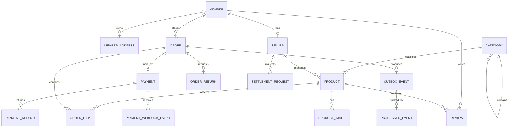

# YMall 데이터 모델

## 설계 원칙

- 회원 계정에 역할을 부여하고 판매자 고유 정보는 연결된 판매자 프로필로 분리합니다.
- 주문 당시 상품명과 가격을 주문항목에 보존하여 이후 상품 변경과 분리합니다.
- 결제, 환불과 웹훅 이력을 분리해 상태 변화를 추적합니다.
- Outbox와 소비 이력으로 메시지 유실·중복 처리 가능성을 줄입니다.
- 스키마 변경은 Flyway migration으로 이력화합니다.

## 핵심 관계

이 다이어그램은 이해에 필요한 관계만 표현합니다. 실제 컬럼과 인덱스의 기준은 `backend/src/main/resources/db/migration`입니다.

| 영역 | 대표 데이터 | 핵심 기준 |
| --- | --- | --- |
| 회원·판매자 | 계정, OAuth, 주소, 판매자 프로필 | 비밀번호 해시, 역할과 소유권 검증 |
| 상품 | 3단계 카테고리, 상품, 이미지, 변경 이력 | 재고·승인 상태 서버 검증 |
| 주문·결제 | 주문, 항목, 반품, 결제, 환불, 웹훅 | 시점별 Snapshot, 멱등성과 상태 전이 |
| 메시징 | Outbox, 처리 이력 | 재시도 상태와 중복 소비 추적 |
| 운영 | 알림, 문의, 정산 | 사용자·판매자별 접근 제한 |

## 변경 절차

기존 migration을 수정하지 않고 다음 버전을 추가합니다. PostgreSQL Testcontainers로 문법과 제약조건을 검증하고, 시작 시 Flyway 적용 뒤 JPA 매핑을 확인합니다. 자세한 복구 기준은 [Flyway 이력 관리](flyway-migration-history.md)와 [PostgreSQL 통합 테스트](postgresql-integration-tests.md)를 참고합니다.
